<html>
<body>

<b>SISTEMA
BanPlu<o:p></o:p></b>

<b><o:p>&nbsp;</o:p></b>

<b>BANCO
DE DADOS PLUVIOMÉTRICO HISTÓRICO<o:p></o:p></b>

<o:p>&nbsp;</o:p>

<o:p>&nbsp;</o:p>

<b style='mso-bidi-font-weight:normal'> 
</b>

<b style='mso-bidi-font-weight:
normal'><o:p>&nbsp;</o:p></b>

<b>SUMÁRIO
</b><o:p></o:p>

<o:p>&nbsp;</o:p>

<!--[if supportFields]> TOC \o &quot;1-3&quot; \h \z \u <![endif]--><a href="#_Toc457891321">1 
COMPONENTES DO SISTEMA. <!--[if supportFields]> PAGEREF _Toc457891321 \h <![endif]-->4<!--[if gte mso 9]><xml>
 <w:data>08D0C9EA79F9BACE118C8200AA004BA90B02000000080000000E0000005F0054006F0063003400350037003800390031003300320031000000</w:data>
</xml><![endif]--><!--[if supportFields]><![endif]--></a><o:p></o:p>

<a href="#_Toc457891322">1.1
 Sumário de Estações. <!--[if supportFields]> PAGEREF _Toc457891322 \h <![endif]-->4<!--[if gte mso 9]><xml>
 <w:data>08D0C9EA79F9BACE118C8200AA004BA90B02000000080000000E0000005F0054006F0063003400350037003800390031003300320032000000</w:data>
</xml><![endif]--><!--[if supportFields]><![endif]--></a><o:p></o:p>

<a href="#_Toc457891323">1.2
- IMPORTAÇÃO DE DADOS. <!--[if supportFields]> PAGEREF _Toc457891323 \h <![endif]-->5<!--[if gte mso 9]><xml>
 <w:data>08D0C9EA79F9BACE118C8200AA004BA90B02000000080000000E0000005F0054006F0063003400350037003800390031003300320033000000</w:data>
</xml><![endif]--><!--[if supportFields]><![endif]--></a><o:p></o:p>

<a href="#_Toc457891324">1.3
 DETALHE DA ESTAÇÃO.. <!--[if supportFields]> PAGEREF _Toc457891324 \h <![endif]-->6<!--[if gte mso 9]><xml>
 <w:data>08D0C9EA79F9BACE118C8200AA004BA90B02000000080000000E0000005F0054006F0063003400350037003800390031003300320034000000</w:data>
</xml><![endif]--><!--[if supportFields]><![endif]--></a><o:p></o:p>

<a href="#_Toc457891325">1.4
 ANÁLISE CLIMATOLÓGICA DA ESTAÇÃO.. <!--[if supportFields]> PAGEREF _Toc457891325 \h <![endif]-->8<!--[if gte mso 9]><xml>
 <w:data>08D0C9EA79F9BACE118C8200AA004BA90B02000000080000000E0000005F0054006F0063003400350037003800390031003300320035000000</w:data>
</xml><![endif]--><!--[if supportFields]><![endif]--></a><o:p></o:p>

<a href="#_Toc457891326">1.4.1
- Totalizações. <!--[if supportFields]> PAGEREF _Toc457891326 \h <![endif]-->8<!--[if gte mso 9]><xml>
 <w:data>08D0C9EA79F9BACE118C8200AA004BA90B02000000080000000E0000005F0054006F0063003400350037003800390031003300320036000000</w:data>
</xml><![endif]--><!--[if supportFields]><![endif]--></a><o:p></o:p>

<a href="#_Toc457891327">1.4.2
 Veranicos observados. <!--[if supportFields]> PAGEREF _Toc457891327 \h <![endif]-->10<!--[if gte mso 9]><xml>
 <w:data>08D0C9EA79F9BACE118C8200AA004BA90B02000000080000000E0000005F0054006F0063003400350037003800390031003300320037000000</w:data>
</xml><![endif]--><!--[if supportFields]><![endif]--></a><o:p></o:p>

<a href="#_Toc457891328">1.4.3
 Dias chuvosos Consecutivos Observados. <!--[if supportFields]> PAGEREF _Toc457891328 \h <![endif]-->11<!--[if gte mso 9]><xml>
 <w:data>08D0C9EA79F9BACE118C8200AA004BA90B02000000080000000E0000005F0054006F0063003400350037003800390031003300320038000000</w:data>
</xml><![endif]--><!--[if supportFields]><![endif]--></a><o:p></o:p>

<a href="#_Toc457891329">1.4.4
 Balanço Climático. <!--[if supportFields]> PAGEREF _Toc457891329 \h <![endif]-->12<!--[if gte mso 9]><xml>
 <w:data>08D0C9EA79F9BACE118C8200AA004BA90B02000000080000000E0000005F0054006F0063003400350037003800390031003300320039000000</w:data>
</xml><![endif]--><!--[if supportFields]><![endif]--></a><o:p></o:p>

<a href="#_Toc457891330">1.4.5
- Gráficos. <!--[if supportFields]> PAGEREF _Toc457891330 \h <![endif]-->14<!--[if gte mso 9]><xml>
 <w:data>08D0C9EA79F9BACE118C8200AA004BA90B02000000080000000E0000005F0054006F0063003400350037003800390031003300330030000000</w:data>
</xml><![endif]--><!--[if supportFields]><![endif]--></a><o:p></o:p>

<a href="#_Toc457891331">1.4.6
 Exportação das Análises. <!--[if supportFields]> PAGEREF
_Toc457891331 \h <![endif]-->16<!--[if gte mso 9]><xml>
 <w:data>08D0C9EA79F9BACE118C8200AA004BA90B02000000080000000E0000005F0054006F0063003400350037003800390031003300330031000000</w:data>
</xml><![endif]--><!--[if supportFields]><![endif]--></a><o:p></o:p>

<a href="#_Toc457891332">1.5
 MÉDIAS MENSAIS. <!--[if supportFields]> PAGEREF _Toc457891332 \h <![endif]-->17<!--[if gte mso 9]><xml>
 <w:data>08D0C9EA79F9BACE118C8200AA004BA90B02000000080000000E0000005F0054006F0063003400350037003800390031003300330032000000</w:data>
</xml><![endif]--><!--[if supportFields]><![endif]--></a><o:p></o:p>

<a href="#_Toc457891333">1.6
 EXPORTAÇÃO DOS DADOS DA ESTAÇÃO.. <!--[if supportFields]> PAGEREF _Toc457891333 \h <![endif]-->18<!--[if gte mso 9]><xml>
 <w:data>08D0C9EA79F9BACE118C8200AA004BA90B02000000080000000E0000005F0054006F0063003400350037003800390031003300330033000000</w:data>
</xml><![endif]--><!--[if supportFields]><![endif]--></a><o:p></o:p>

<a href="#_Toc457891334">1.7
- EXPORTAÇÃO DE ANÁLISES PARA SIG SPRING (SPR) <!--[if supportFields]> PAGEREF _Toc457891334 \h <![endif]-->19<!--[if gte mso 9]><xml>
 <w:data>08D0C9EA79F9BACE118C8200AA004BA90B02000000080000000E0000005F0054006F0063003400350037003800390031003300330034000000</w:data>
</xml><![endif]--><!--[if supportFields]><![endif]--></a><o:p></o:p>

<a href="#_Toc457891335">1.8
 IMPRIMIR SUMÁRIO.. <!--[if supportFields]> PAGEREF _Toc457891335 \h <![endif]-->21<!--[if gte mso 9]><xml>
 <w:data>08D0C9EA79F9BACE118C8200AA004BA90B02000000080000000E0000005F0054006F0063003400350037003800390031003300330035000000</w:data>
</xml><![endif]--><!--[if supportFields]><![endif]--></a><o:p></o:p>

<!--[if supportFields]><b></b><![endif]--><o:p>&nbsp;</o:p>

<b style='mso-bidi-font-weight:normal'><o:p>&nbsp;</o:p></b>

<b style='mso-bidi-font-weight:normal'><o:p>&nbsp;</o:p></b>

<b style='mso-bidi-font-weight:normal'> 
</b>

<o:p>&nbsp;</o:p>

<h1><a name="_Toc457891321">1  </a>SISTEMA BANPLU</h1>

<o:p>&nbsp;</o:p>

            O sistema descrito
 permite várias operações e
análises com os dados armazenados no banco relacional. Aqui descrevemos os
vários componentes do sistema, suas interfaces, funcionalidades e saídas de
dados.<o:p></o:p>

<o:p>&nbsp;</o:p>

<h2><a name="_Toc457891322">1.1  Sumário de Estações</a></h2>

<o:p>&nbsp;</o:p>

Na tela inicial do sistema é apresentado o
sumário das estações meteorológicas armazenadas no banco de dados. As estações
são exibidas por UF. O usuário seleciona a UF pretendida e o sistema exibe
todas as informações das estações daquela UF:<o:p></o:p>

<![if !supportLists]>·&nbsp;&nbsp;&nbsp;&nbsp;&nbsp;&nbsp;
<![endif]>Número sequencial<o:p></o:p>

<![if !supportLists]>·&nbsp;&nbsp;&nbsp;&nbsp;&nbsp;&nbsp;
<![endif]>Código da Estação<o:p></o:p>

<![if !supportLists]>·&nbsp;&nbsp;&nbsp;&nbsp;&nbsp;&nbsp;
<![endif]>Nome da Estação<o:p></o:p>

<![if !supportLists]>·&nbsp;&nbsp;&nbsp;&nbsp;&nbsp;&nbsp;
<![endif]>Município da Estação<o:p></o:p>

<![if !supportLists]>·&nbsp;&nbsp;&nbsp;&nbsp;&nbsp;&nbsp;
<![endif]>UF<o:p></o:p>

<![if !supportLists]>·&nbsp;&nbsp;&nbsp;&nbsp;&nbsp;&nbsp;
<![endif]>Latitude<o:p></o:p>

<![if !supportLists]>·&nbsp;&nbsp;&nbsp;&nbsp;&nbsp;&nbsp;
<![endif]>Longitude<o:p></o:p>

<![if !supportLists]>·&nbsp;&nbsp;&nbsp;&nbsp;&nbsp;&nbsp;
<![endif]>Altitude<o:p></o:p>

<![if !supportLists]>·&nbsp;&nbsp;&nbsp;&nbsp;&nbsp;&nbsp;
<![endif]>Período de Observação<o:p></o:p>

<![if !supportLists]>·&nbsp;&nbsp;&nbsp;&nbsp;&nbsp;&nbsp;
<![endif]>Quantidade de Anos observados<o:p></o:p>

<![if !supportLists]>·&nbsp;&nbsp;&nbsp;&nbsp;&nbsp;&nbsp;
<![endif]>Índice de completude dos dados<o:p></o:p>

<![if !supportLists]>·&nbsp;&nbsp;&nbsp;&nbsp;&nbsp;&nbsp;
<![endif]>Fonte dos dados<o:p></o:p>

<![if !supportLists]>·&nbsp;&nbsp;&nbsp;&nbsp;&nbsp;&nbsp;
<![endif]>Chuva Média Anual<o:p></o:p>

<![if !supportLists]>·&nbsp;&nbsp;&nbsp;&nbsp;&nbsp;&nbsp;
<![endif]>Temperatura Média Anual<o:p></o:p>

<!--[if gte vml 1]><v:shapetype
 id="_x0000_t75" coordsize="21600,21600" o:spt="75" o:preferrelative="t"
 path="m@4@5l@4@11@9@11@9@5xe" filled="f" stroked="f">
 <v:stroke joinstyle="miter"/>
 <v:formulas>
  <v:f eqn="if lineDrawn pixelLineWidth 0"/>
  <v:f eqn="sum @0 1 0"/>
  <v:f eqn="sum 0 0 @1"/>
  <v:f eqn="prod @2 1 2"/>
  <v:f eqn="prod @3 21600 pixelWidth"/>
  <v:f eqn="prod @3 21600 pixelHeight"/>
  <v:f eqn="sum @0 0 1"/>
  <v:f eqn="prod @6 1 2"/>
  <v:f eqn="prod @7 21600 pixelWidth"/>
  <v:f eqn="sum @8 21600 0"/>
  <v:f eqn="prod @7 21600 pixelHeight"/>
  <v:f eqn="sum @10 21600 0"/>
 </v:formulas>
 <v:path o:extrusionok="f" gradientshapeok="t" o:connecttype="rect"/>
 <o:lock v:ext="edit" aspectratio="t"/>
</v:shapetype><v:shape id="_x0000_i1025" type="#_x0000_t75" style='width:452.75pt;
 height:305.3pt'>
 <v:imagedata src="readme_arquivos/image001.png" o:title=""/>
</v:shape><![endif]--><![if !vml]>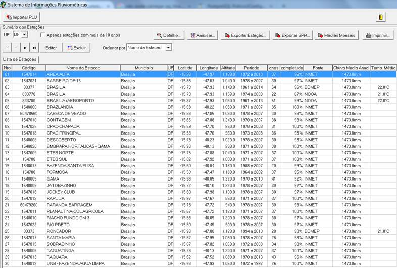<![endif]>

<a name="_Toc449440308">Figura </a><!--[if supportFields]> SEQ
Figura \* ARABIC <![endif]-->2<!--[if supportFields]><![endif]-->  Tela do Sumário das Estações do Distrito
Federal<o:p></o:p>

O
usuário tem a opção de ordenar as estações por quaisquer dos campos e
opcionalmente filtrar as estações, exibindo apenas aquelas com mais de 10 anos
de observações.<o:p></o:p>

            A partir desta tela inicial, o
usuário tem acesso a todas as outras funcionalidades do sistema que serão
descritas nos tópicos abaixo.<o:p></o:p>

<o:p>&nbsp;</o:p>

<h2><a name="_Toc457891323">1.2 - IMPORTAÇÃO DE DADOS</a></h2>

<o:p>&nbsp;</o:p>

            Esta função permite a importação de
dados de chuva no formato .PLU.<o:p></o:p>

            O formato PLU foi desenvolvido pela
Embrapa e consiste de um arquivo em formato texto com
24 linhas e 15 colunas. Cada duas linhas correspondendo a um mês de
observações.<o:p></o:p>

            Durante a importação, caso a estação
não esteja cadastrada, o sistema faz o cadastro da estação e procede a
importação dos dados.<o:p></o:p>

            Após a importação, são calculados a
completude dos anos observados e os demais índices necessários para outras
saídas como os balanços hídricos.<o:p></o:p>

<!--[if gte vml 1]><v:shape
 id="Imagem_x0020_1" o:spid="_x0000_i1026" type="#_x0000_t75" style='width:314.5pt;
 height:423.35pt;visibility:visible'>
 <v:imagedata src="readme_arquivos/image003.png" o:title=""/>
</v:shape><![endif]--><![if !vml]>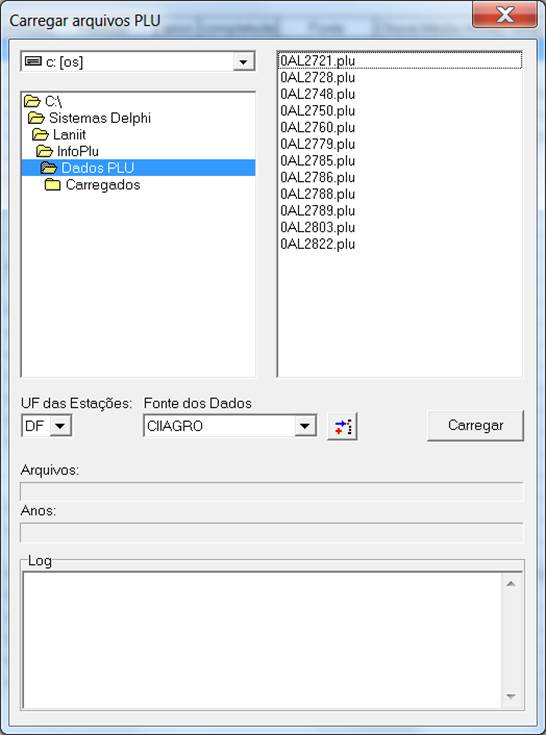<![endif]>

<a name="_Toc449440309">Figura </a><!--[if supportFields]> SEQ
Figura \* ARABIC <![endif]-->3<!--[if supportFields]><![endif]-->  Tela da Importação de dados PLU<o:p></o:p>

<o:p>&nbsp;</o:p>

<h2><a name="_Toc457891324">1.3  DETALHE DA ESTAÇÃO</a></h2>

<o:p>&nbsp;</o:p>

            Exibe em detalhes os anos de
observação de cada estação. Para o calculo da
completude, divide-se o número de observações em cada ano pelo número de dias
daquele ano. Para tanto, leva-se em consideração se o ano é bissexto. O índice
de completude é calculado em percentagem. 100% significa
que todos os dias daquele ano teem observações
cadastradas.<o:p></o:p>

<!--[if gte vml 1]><v:shape
 id="_x0000_i1027" type="#_x0000_t75" style='width:4in;height:390.55pt;
 visibility:visible'>
 <v:imagedata src="readme_arquivos/image005.png" o:title=""/>
</v:shape><![endif]--><![if !vml]>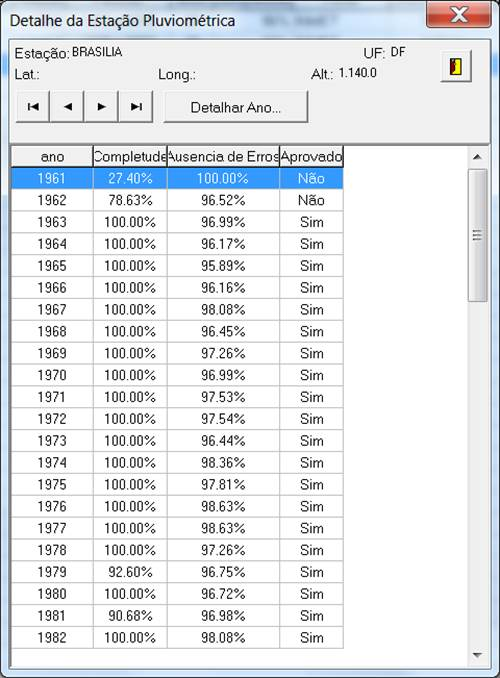<![endif]>

<a name="_Toc449440310">Figura </a><!--[if supportFields]> SEQ
Figura \* ARABIC <![endif]-->4<!--[if supportFields]><![endif]-->  Tela do Sumário dos anos observados

<!--[if gte vml 1]><v:shape id="_x0000_i1028" type="#_x0000_t75"
 style='width:441.8pt;height:202.75pt;visibility:visible'>
 <v:imagedata src="readme_arquivos/image007.png" o:title=""/>
</v:shape><![endif]--><![if !vml]>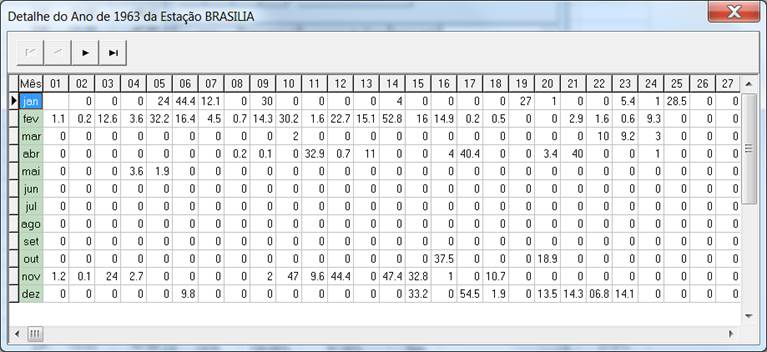<![endif]>

<a name="_Toc449440311">Figura </a><!--[if supportFields]> SEQ
Figura \* ARABIC <![endif]-->5<!--[if supportFields]><![endif]-->  Tela do Detalhe de um ano de observações

<o:p>&nbsp;</o:p>

<h2><a name="_Toc457891325">1.4  ANÁLISE CLIMATOLÓGICA DA ESTAÇÃO</a></h2>

<o:p>&nbsp;</o:p>

            A análise climatológica da estação é
o coração do sistema e pode ser feita em diferentes cortes temporais. As
análises podem ser<o:p></o:p>

<ul style='margin-top:0cm' type=disc>
 <li class=MsoNormal style='margin-bottom:0cm;text-align:justify;line-height:
     150%;mso-list:l21 level1 lfo19;mso-layout-grid-align:none;text-autospace:
     none'>Anuais,<o:p></o:p></li>
 <li class=MsoNormal style='margin-bottom:0cm;text-align:justify;line-height:
     150%;mso-list:l21 level1 lfo19;mso-layout-grid-align:none;text-autospace:
     none'>Mensais,<o:p></o:p></li>
 <li class=MsoNormal style='margin-bottom:0cm;text-align:justify;line-height:
     150%;mso-list:l21 level1 lfo19;mso-layout-grid-align:none;text-autospace:
     none'>Quinzenais,<o:p></o:p></li>
 <li class=MsoNormal style='margin-bottom:0cm;text-align:justify;line-height:
     150%;mso-list:l21 level1 lfo19;mso-layout-grid-align:none;text-autospace:
     none'>Decendiais
     (período de dez dias) e<o:p></o:p></li>
 <li class=MsoNormal style='margin-bottom:0cm;text-align:justify;line-height:
     150%;mso-list:l21 level1 lfo19;mso-layout-grid-align:none;text-autospace:
     none'>Pentadais
     (período de cinco dias).<o:p></o:p></li>
</ul>

Está subdividida
em outras análises, descritas abaixo.<o:p></o:p>

<o:p>&nbsp;</o:p>

<!--[if gte vml 1]><v:shape
 id="_x0000_i1029" type="#_x0000_t75" style='width:453.3pt;height:209.65pt'>
 <v:imagedata src="readme_arquivos/image009.png" o:title=""/>
</v:shape><![endif]--><![if !vml]>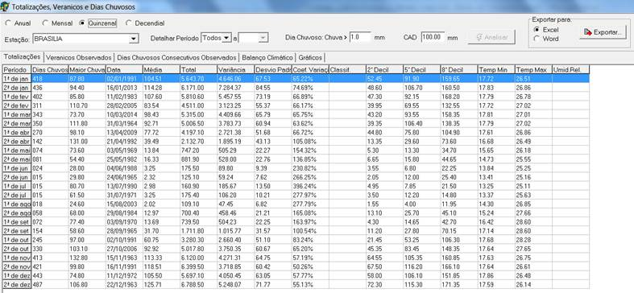<![endif]>

<a name="_Toc449440312">Figura </a><!--[if supportFields]> SEQ
Figura \* ARABIC <![endif]-->6<!--[if supportFields]><![endif]-->  Tela exemplo de análise climática
quinzenal<o:p></o:p>

<h3><a name="_Toc457891326">1.4.1 - Totalizações</a></h3>

<o:p>&nbsp;</o:p>

A primeira aba
exibe a totalização de diversas variáveis climatológicas e outras
referentes à análise estatística dos dados:<o:p></o:p>

<ul style='margin-top:0cm' type=disc>
 <li class=MsoNormal style='margin-bottom:0cm;text-align:justify;line-height:
     150%;mso-list:l14 level1 lfo20;mso-layout-grid-align:none;text-autospace:
     none'>Período
     analisado,<o:p></o:p></li>
 <li class=MsoNormal style='margin-bottom:0cm;text-align:justify;line-height:
     150%;mso-list:l14 level1 lfo20;mso-layout-grid-align:none;text-autospace:
     none'>Quantidade
     de Dias Chuvosos,<o:p></o:p></li>
 <li class=MsoNormal style='margin-bottom:0cm;text-align:justify;line-height:
     150%;mso-list:l14 level1 lfo20;mso-layout-grid-align:none;text-autospace:
     none'>Maior
     Chuva,<o:p></o:p></li>
 <li class=MsoNormal style='margin-bottom:0cm;text-align:justify;line-height:
     150%;mso-list:l14 level1 lfo20;mso-layout-grid-align:none;text-autospace:
     none'>Data
     da Maior Chuva,<o:p></o:p></li>
 <li class=MsoNormal style='margin-bottom:0cm;text-align:justify;line-height:
     150%;mso-list:l14 level1 lfo20;mso-layout-grid-align:none;text-autospace:
     none'>Chuva
     Média no Período,<o:p></o:p></li>
 <li class=MsoNormal style='margin-bottom:0cm;text-align:justify;line-height:
     150%;mso-list:l14 level1 lfo20;mso-layout-grid-align:none;text-autospace:
     none'>Chuva
     Total no Período<o:p></o:p></li>
 <li class=MsoNormal style='margin-bottom:0cm;text-align:justify;line-height:
     150%;mso-list:l14 level1 lfo20;mso-layout-grid-align:none;text-autospace:
     none'>Variância
     dos dados,<o:p></o:p></li>
 <li class=MsoNormal style='margin-bottom:0cm;text-align:justify;line-height:
     150%;mso-list:l14 level1 lfo20;mso-layout-grid-align:none;text-autospace:
     none'>Desvio
     Padrão dos dados,<o:p></o:p></li>
 <li class=MsoNormal style='margin-bottom:0cm;text-align:justify;line-height:
     150%;mso-list:l14 level1 lfo20;mso-layout-grid-align:none;text-autospace:
     none'>Coeficiente
     de Variação<o:p></o:p></li>
 <li class=MsoNormal style='margin-bottom:0cm;text-align:justify;line-height:
     150%;mso-list:l14 level1 lfo20;mso-layout-grid-align:none;text-autospace:
     none'>Classificação
     dos Anos (Seco, Normal ou Chuvoso),<o:p></o:p></li>
 <li class=MsoNormal style='margin-bottom:0cm;text-align:justify;line-height:
     150%;mso-list:l14 level1 lfo20;mso-layout-grid-align:none;text-autospace:
     none'>Separatrizes
     dos dados no 2º, 5º e 8º decil<o:p></o:p></li>
 <li class=MsoNormal style='margin-bottom:0cm;text-align:justify;line-height:
     150%;mso-list:l14 level1 lfo20;mso-layout-grid-align:none;text-autospace:
     none'>Temperatura
     Mínima do Período<o:p></o:p></li>
 <li class=MsoNormal style='margin-bottom:0cm;text-align:justify;line-height:
     150%;mso-list:l14 level1 lfo20;mso-layout-grid-align:none;text-autospace:
     none'>Temperatura
     Máxima no Período<o:p></o:p></li>
</ul>

<o:p>&nbsp;</o:p>

Em estatística
descritiva, decil é qualquer um dos nove valores que dividem os dados ordenados
de uma variável em dez partes iguais, de modo que cada parte representa 1/10 da
amostra ou população. Assim:<o:p></o:p>

<o:p>&nbsp;</o:p>

    O 2º decil é o ponto de corte para 20% dos
dados mais baixos, i. e., o percentil 20.<o:p></o:p>

    O 5º decil é o ponto de corte para 50% dos
dados, i. e., o percentil 50, 2º quartil, ou mediana.<o:p></o:p>

    O 8º decil é o limite para 80% dos dados mais
baixos, i. e., o percentil 80.<o:p></o:p>

<!--[if gte vml 1]><v:shape
 id="_x0000_i1030" type="#_x0000_t75" style='width:453.3pt;height:397.45pt'>
 <v:imagedata src="readme_arquivos/image011.png" o:title=""/>
</v:shape><![endif]--><![if !vml]>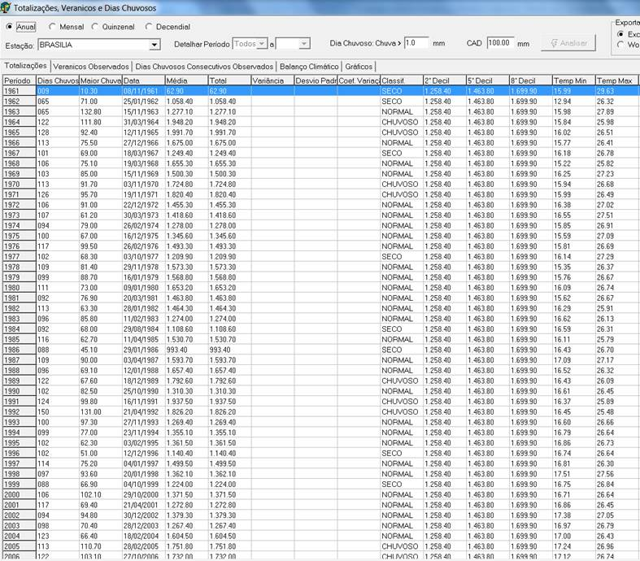<![endif]>

<a name="_Toc449440313">Figura </a><!--[if supportFields]> SEQ
Figura \* ARABIC <![endif]-->7<!--[if supportFields]><![endif]-->  Tela exemplo de Totalização Anual

<o:p>&nbsp;</o:p>

<h3><a name="_Toc457891327">1.4.2  Veranicos observados</a></h3>

<o:p>&nbsp;</o:p>

Veranicos
são períodos sem chuva dentro do período chuvoso. Para o calculo
de veranicos, são contados os dias consecutivos sem chuva, ou com chuva menor
que o dia chuvoso especificado nos parâmetros do módulo.<o:p></o:p>

Ao
encontrar um veranico, o sistema o classifica pelo número de dias consecutivos,
podendo ser de 5 dias, 6 a 10 dias, 11 a 15 dias, 16 a 20 dias.<o:p></o:p>

            Após a contagem dos veranicos, a
soma dos veranicos do período é dividida pelo número de períodos observados. O
número resultante representa a probabilidade de ocorrência de veranicos naquele
período.<o:p></o:p>

            Os dados são apresentados no formato
[Nº de veranicos observados]-[Probabilidade de
ocorrência]%<o:p></o:p>

<o:p>&nbsp;</o:p>

<!--[if gte vml 1]><v:shape
 id="_x0000_i1031" type="#_x0000_t75" style='width:385.35pt;height:240.2pt'>
 <v:imagedata src="readme_arquivos/image013.png" o:title=""/>
</v:shape><![endif]--><![if !vml]>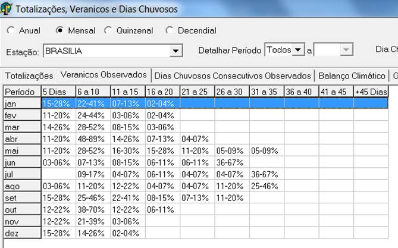<![endif]>

<a name="_Toc449440314">Figura </a><!--[if supportFields]> SEQ
Figura \* ARABIC <![endif]-->8<!--[if supportFields]><![endif]-->  Tela dos Veranicos Observados nos
períodos selecionados<o:p></o:p>

<o:p>&nbsp;</o:p>

<h3><a name="_Toc457891328">1.4.3  Dias chuvosos Consecutivos Observados</a></h3>

<o:p>&nbsp;</o:p>

Os
dias com chuva superior ao dia chuvoso especificado no parâmetro do módulo são
classificados como dias chuvosos.<o:p></o:p>

Aqui
são computados os dias chuvosos consecutivos que são classificados de acordo
com a sua duração: 2 dias, 3 dias, 4 dias,  5 dias, 6 dias, 7 dias...<o:p></o:p>

Após
a contagem dos dias chuvosos consecutivos, a soma das ocorrências de dias
chuvosos é dividida pelo número de períodos observados. O número resultante
representa a probabilidade de ocorrência de dias chuvosos consecutivos naquele
período.<o:p></o:p>

<o:p>&nbsp;</o:p>

<!--[if gte vml 1]><v:shape
 id="_x0000_i1032" type="#_x0000_t75" style='width:419.9pt;height:243.65pt'>
 <v:imagedata src="readme_arquivos/image015.png" o:title=""/>
</v:shape><![endif]--><![if !vml]>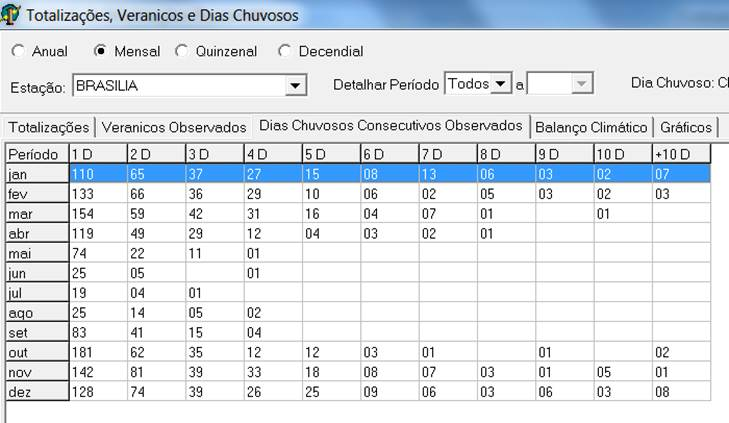<![endif]>

<a name="_Toc449440315">Figura </a><!--[if supportFields]> SEQ
Figura \* ARABIC <![endif]-->9<!--[if supportFields]><![endif]-->  Tela dos Dias chuvosos consecutivos<o:p></o:p>

<o:p>&nbsp;</o:p>

<h3><a name="_Toc457891329">1.4.4  Balanço Climático</a></h3>

<o:p>&nbsp;</o:p>

O balanço hídrico
é um sistema contábil de monitoramento da água do solo e resulta da aplicação
do princípio de conservação de massa para a água num volume de solo vegetado.<o:p></o:p>

     O balanço hídrico climatológico, descrito
por Thornthwaite e Mather (1955) é uma das diversas
maneiras de se monitorar o armazenamento de água no solo. Partindo-se do
suprimento natural de água para o solo, simbolizado pelas chuvas e da demanda
atmosfera, simbolizada pela evapotranspiração potencial, e com um armazenamento
máximo apropriado para a planta cultivada, o balanço hídrico fornece
estimativas do armazenamento de água no solo, evapotranspiração real, da
deficiência hídrica e do excedente hídrico em diversas escalas de tempo.<o:p></o:p>

A
capacidade máxima de água disponível no solo foi fixada em 100 mm e a
evapotranspiração potencial (ET0) foi estimada pelo método de THORNTHWAITE
(1948). Os valores de temperatura e precipitação correspondem às médias
históricas para os períodos selecionados, na estação de interesse.<o:p></o:p>

<o:p>&nbsp;</o:p>

<!--[if gte vml 1]><v:shape
 id="_x0000_i1033" type="#_x0000_t75" style='width:453.3pt;height:224.05pt'>
 <v:imagedata src="readme_arquivos/image017.png" o:title=""/>
</v:shape><![endif]--><![if !vml]>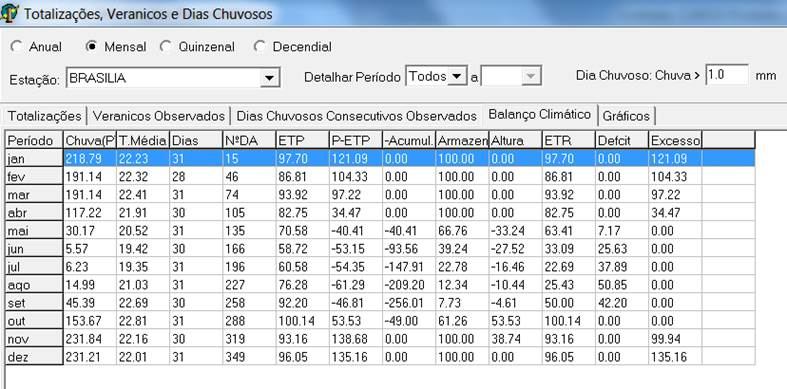<![endif]>

<a name="_Toc449440316">Figura </a><!--[if supportFields]> SEQ
Figura \* ARABIC <![endif]-->10<!--[if supportFields]><![endif]-->  Tabela do Balanço Hídrico Climatológico<o:p></o:p>

Para se elaborar o
BHC, seja ele o Normal ou o Seqüencial, há a
necessidade de se conhecer a capacidade de água disponível no solo (CAD). A CAD
representa o máximo de 
água  disponível  que 
determinado  tipo  de 
solo  pode  reter 
em função  de  suas características físico-hídricas, ou
seja, umidade da capa cidade de campo (&#952;cc),
umidade do   ponto   de  
murcha   permanente   (&#952; pmp),   massa  
específica   do   solo  
(dg)   e   da profundidade efetiva do sistema radicular
(Zr), onde se concentram cerca de 80% das raízes. No sistema a CAD é um dos
parâmetros informados na análise.<o:p></o:p>

<o:p>&nbsp;</o:p>

Estimativa da ETP 
deve-se estimar a ETP com o método mais adequado para a região, em função dos
dados meteorológicos disponíveis.<o:p></o:p>

<o:p>&nbsp;</o:p>

Calcular (P-ETP),
mantendo-se os sinais positivos (+) e negativos (-)<o:p></o:p>

<o:p>&nbsp;</o:p>

Determinação do NAc e do ARM<o:p></o:p>

<o:p>&nbsp;</o:p>

&#8658;Se (P-ETP) &lt; 0 &#8658;Calcula-se o NAc, ou seja os valores de (P-ETP)
negativos, e posteriormente se calcula o valor do ARM (ARM = CAD e -|NAc/CAD|)<o:p></o:p>

<o:p>&nbsp;</o:p>

&#8658; Se (P-ETP)&#8805;0
&#8658; Calcula-se
primeiro o ARM [ARM = ARM anterior + (P-ETP)] e posteriormente  calcula-se 
o  NAc  [NAc  =  CAD  Ln  (ARM/CAD)]. 
Nesse caso o  NAc deve ser determinado no caso de haver um próximo
período com (P-ETP)&lt;0<o:p></o:p>

<o:p>&nbsp;</o:p>

Cálculo da
Alteração (ALT =&#8710;ARM)<o:p></o:p>

ALT = ARM  ARM
anterior (ALT &gt; 0&#8658; reposição;
ALT &lt; 0 &#8658; retirada
de água do solo)<o:p></o:p>

<o:p>&nbsp;</o:p>

Determinação da ETR
(Evapotranspiração Real)<o:p></o:p>

Se (P-ETP) &lt; 0 &#8658; ETR = P + |ALT|<o:p></o:p>

Se (P-ETP) &#8805;
0 &#8658; ETR = ETP<o:p></o:p>

Determinação  da  DEF  (Deficiência  hídrica 
=  o  quanto 
o  sistema  solo-planta deixou de evapotranspirar)<o:p></o:p>

DEF = ETP - ETR<o:p></o:p>

<o:p>&nbsp;</o:p>

Determinação do
EXC (Excedente hídrico, que corresponde à água que não pode ser retida e drena
em profundidade = água gravitacional)<o:p></o:p>

Se ARM &lt; CAD &#8658; EXC = 0<o:p></o:p>

Se ARM = CAD &#8658; EXC = (P-ETP) -
ALT<o:p></o:p>

<o:p>&nbsp;</o:p>

<h3><a name="_Toc457891330">1.4.5 - Gráficos</a></h3>

<o:p>&nbsp;</o:p>

O
sistema gera automaticamente alguns gráficos que refletem de forma visual os
resultados das análises.<o:p></o:p>

Os
gráficos podem ser exportados ou impressos e ainda podem ser exibidos em 3D
para uma melhor visualização das linhas e suas cores.<o:p></o:p>

<![if !supportLists]>·&nbsp;&nbsp;&nbsp;&nbsp;&nbsp;&nbsp; <![endif]>Chuva
e temperatura média,<o:p></o:p>

<![if !supportLists]>·&nbsp;&nbsp;&nbsp;&nbsp;&nbsp;&nbsp; <![endif]>Chuva
Total,<o:p></o:p>

<![if !supportLists]>·&nbsp;&nbsp;&nbsp;&nbsp;&nbsp;&nbsp; <![endif]>Desvio
Padrão,<o:p></o:p>

<![if !supportLists]>·&nbsp;&nbsp;&nbsp;&nbsp;&nbsp;&nbsp; <![endif]>Coeficiente
de variação,<o:p></o:p>

<![if !supportLists]>·&nbsp;&nbsp;&nbsp;&nbsp;&nbsp;&nbsp; <![endif]>Análise
Frequencial e<o:p></o:p>

<![if !supportLists]>·&nbsp;&nbsp;&nbsp;&nbsp;&nbsp;&nbsp; <![endif]>Balanço
Hídrico<o:p></o:p>

<o:p>&nbsp;</o:p>

<!--[if gte vml 1]><v:shape
 id="_x0000_i1034" type="#_x0000_t75" style='width:442.35pt;height:237.9pt;
 visibility:visible'>
 <v:imagedata src="readme_arquivos/image019.png" o:title=""/>
</v:shape><![endif]--><![if !vml]>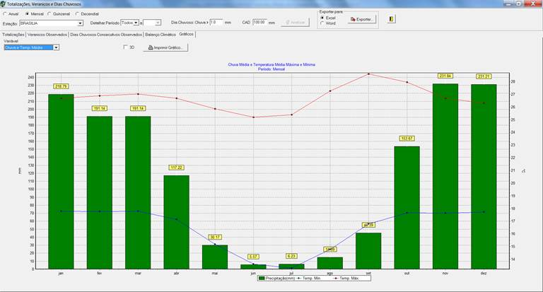<![endif]>

<a name="_Toc449440317">Figura </a><!--[if supportFields]> SEQ
Figura \* ARABIC <![endif]-->11<!--[if supportFields]><![endif]-->  Gráfico da Chuva e Temperatura Média<o:p></o:p>

<o:p>&nbsp;</o:p>

<!--[if gte vml 1]><v:shape
 id="_x0000_i1035" type="#_x0000_t75" style='width:442.35pt;height:237.9pt;
 visibility:visible'>
 <v:imagedata src="readme_arquivos/image021.png" o:title=""/>
</v:shape><![endif]--><![if !vml]>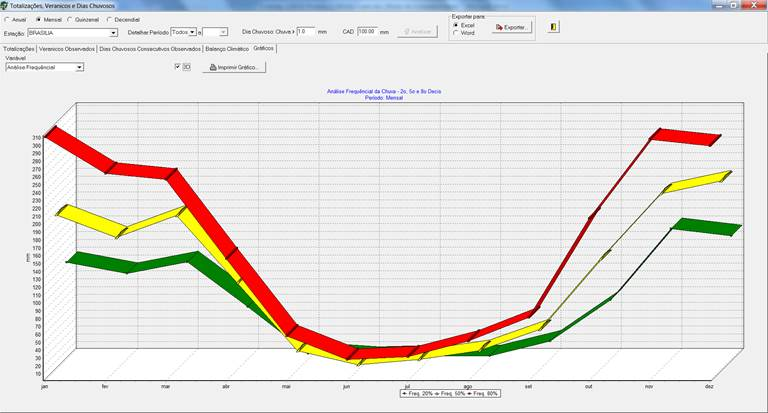<![endif]>

<a name="_Toc449440318">Figura </a><!--[if supportFields]> SEQ
Figura \* ARABIC <![endif]-->12<!--[if supportFields]><![endif]-->  Gráfico da Análise Frequencial
da Chuva<o:p></o:p>

<o:p>&nbsp;</o:p>

<o:p>&nbsp;</o:p>

<!--[if gte vml 1]><v:shape
 id="_x0000_i1036" type="#_x0000_t75" style='width:442.35pt;height:237.9pt;
 visibility:visible'>
 <v:imagedata src="readme_arquivos/image023.png" o:title=""/>
</v:shape><![endif]--><![if !vml]>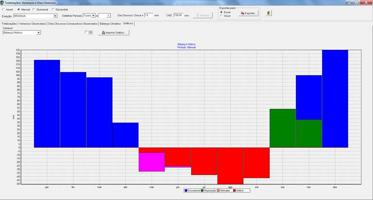<![endif]>

<a name="_Toc449440319">Figura </a><!--[if supportFields]> SEQ
Figura \* ARABIC <![endif]-->13<!--[if supportFields]><![endif]--> - Gráfico do Balanço Hídrico Climatológico<o:p></o:p>

<o:p>&nbsp;</o:p>

<h3><a name="_Toc457891331">1.4.6  Exportação das Análises</a></h3>

<o:p>&nbsp;</o:p>

Object Linking and Embedding
(OLE) é um sistema de objetos distribuídos e um protocolo desenvolvido pela
Microsoft. Ele permite a um editor disponibilizar parte de um documento para
outro editor, e então reimportá-lo. Por exemplo, um
sistema de editoração eletrônica pode enviar texto para um processador de texto
ou uma figura para um editor gráfico usando OLE. O maior benefício em usar essa
tecnologia, além de reduzir o tamanho do arquivo do documento, é a habilidade
em criar um arquivo mestre. Referências para dados nesse arquivo podem ser
feitas, e o arquivo mestre pode então modificar os dados, que serão atualizados
nos respectivos documentos referenciados.<o:p></o:p>

As
análises podem se exportadas para MS-Excel ou MS-Word via OLE. Basta selecionar
o formato pretendido e clicar em exportar.<o:p></o:p>

Vale
lembrar que como a exportação é feita por OLE, a aplicação deve ter total
controle sobre o MS-Excel ou MS-Word.<o:p></o:p>

<o:p>&nbsp;</o:p>

<!--[if gte vml 1]><v:shape
 id="_x0000_i1037" type="#_x0000_t75" style='width:315.05pt;height:119.25pt'>
 <v:imagedata src="readme_arquivos/image025.png" o:title=""/>
</v:shape><![endif]--><![if !vml]>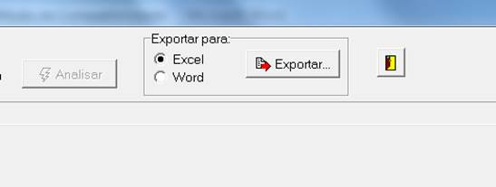<![endif]>

<a name="_Toc449440320">Figura </a><!--[if supportFields]> SEQ
Figura \* ARABIC <![endif]-->14<!--[if supportFields]><![endif]--> - Botão para exportação das análises<o:p></o:p>

<o:p>&nbsp;</o:p>

<h2><a name="_Toc457891332">1.5  MÉDIAS MENSAIS</a></h2>

<o:p>&nbsp;</o:p>

            Esta função exporta um arquivo texto
para cada estação da UF contendo as médias mensais de chuva em cada ano para
todos os anos observados.<o:p></o:p>

<o:p>&nbsp;</o:p>

<!--[if gte vml 1]><v:shape
 id="_x0000_i1038" type="#_x0000_t75" style='width:261.5pt;height:350.8pt'>
 <v:imagedata src="readme_arquivos/image027.png" o:title=""/>
</v:shape><![endif]--><![if !vml]>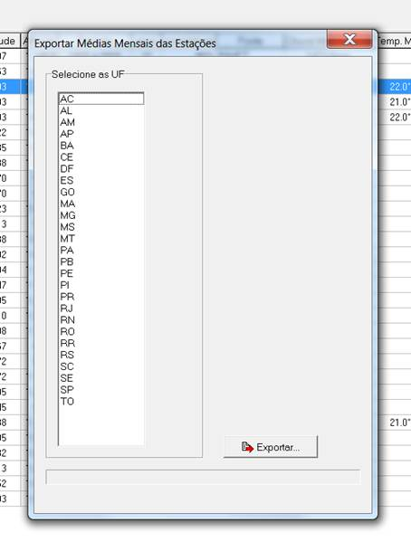<![endif]>

<a name="_Toc449440321">Figura </a><!--[if supportFields]> SEQ
Figura \* ARABIC <![endif]-->15<!--[if supportFields]><![endif]--> - Tela de exportação das Médias Mensais<o:p></o:p>

<o:p>&nbsp;</o:p>

<!--[if gte vml 1]><v:shape
 id="_x0000_i1039" type="#_x0000_t75" style='width:453.3pt;height:304.15pt'>
 <v:imagedata src="readme_arquivos/image029.png" o:title=""/>
</v:shape><![endif]--><![if !vml]>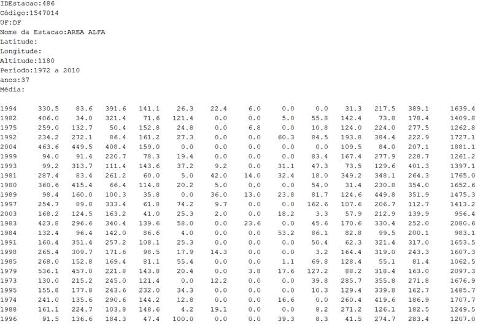<![endif]>

<a name="_Toc449440322">Figura </a><!--[if supportFields]> SEQ
Figura \* ARABIC <![endif]-->16<!--[if supportFields]><![endif]--> - Exemplo de arquivo resultante da Média
Mensal

<o:p>&nbsp;</o:p>

<h2><a name="_Toc457891333">1.6  EXPORTAÇÃO DOS DADOS DA ESTAÇÃO</a></h2>

<o:p>&nbsp;</o:p>

            Os dados da estação podem ser
exportados para o formato MS-Excel,  MS-Word ou Valores Separado Por
Vírgula - CSV<o:p></o:p>

<o:p>&nbsp;</o:p>

<!--[if gte vml 1]><v:shape
 id="_x0000_i1040" type="#_x0000_t75" style='width:343.3pt;height:281.1pt'>
 <v:imagedata src="readme_arquivos/image031.png" o:title=""/>
</v:shape><![endif]--><![if !vml]>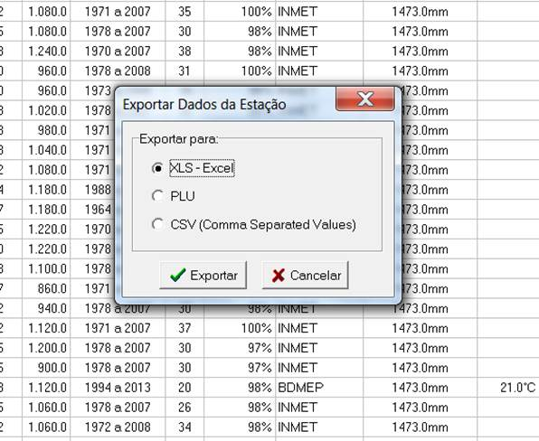<![endif]>

<a name="_Toc449440323">Figura </a><!--[if supportFields]> SEQ
Figura \* ARABIC <![endif]-->17<!--[if supportFields]><![endif]--> - Seleção do formato para exportação dos
dados das estações<o:p></o:p>

<o:p>&nbsp;</o:p>

<h2><a name="_Toc457891334">1.7 - EXPORTAÇÃO DE ANÁLISES PARA SIG SPRING (SPR)</a></h2>

<o:p>&nbsp;</o:p>

            O sistema é capaz de exportar
análises para integração com Sistemas de Informação Geográfica, mais
precisamente com  o
sistema SPRING.<o:p></o:p>

O
SPRING é um SIG (Sistema de Informações Geográficas) no estado-da-arte com
funções de processamento de imagens, análise espacial, modelagem numérica de
terreno e consulta a bancos de dados espaciais.<o:p></o:p>

<o:p>&nbsp;</o:p>

O SPRING é um
projeto do INPE / DPI (Divisãode Processamento de
Imagens) com a participação de:<o:p></o:p>

<o:p>&nbsp;</o:p>

<ul style='margin-top:0cm' type=disc>
 <li class=MsoNormal style='margin-bottom:0cm;text-align:justify;line-height:
     150%;mso-list:l8 level1 lfo22;mso-layout-grid-align:none;text-autospace:
     none'>EMBRAPA/CNPTIA
     - Centro Nacional de Pesquisa Tecnológica em Informática para Agricultura.<o:p></o:p></li>
 <li class=MsoNormal style='margin-bottom:0cm;text-align:justify;line-height:
     150%;mso-list:l8 level1 lfo22;mso-layout-grid-align:none;text-autospace:
     none'>IBM
     Brasil - Centro Latino-Americano de Soluções para Ensino Superior e
     Pesquisa.<o:p></o:p></li>
 <li class=MsoNormal style='margin-bottom:0cm;text-align:justify;line-height:
     150%;mso-list:l8 level1 lfo22;mso-layout-grid-align:none;text-autospace:
     none'>TECGRAF
     - PUC Rio - Grupo de Tecnologia em Computação Gráfica da PUC-Rio.<o:p></o:p></li>
 <li class=MsoNormal style='margin-bottom:0cm;text-align:justify;line-height:
     150%;mso-list:l8 level1 lfo22;mso-layout-grid-align:none;text-autospace:
     none'>PETROBRÁS/CENPES
     - Centro de Pesquisas &quot;Leopoldo Miguez&quot;.<o:p></o:p></li>
</ul>

<o:p>&nbsp;</o:p>

<o:p>&nbsp;</o:p>

<!--[if gte vml 1]><v:shape
 id="_x0000_i1041" type="#_x0000_t75" style='width:341.55pt;height:262.1pt;
 visibility:visible'>
 <v:imagedata src="readme_arquivos/image033.png" o:title=""/>
</v:shape><![endif]--><![if !vml]>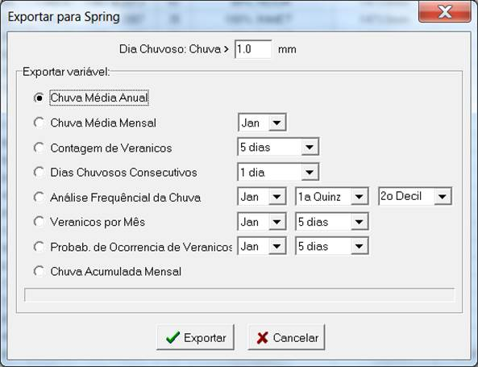<![endif]>

<a name="_Toc449440324">Figura </a><!--[if supportFields]> SEQ
Figura \* ARABIC <![endif]-->18<!--[if supportFields]><![endif]--> - Exportação de dados para Sistema de
Informação Geográficas Spring<o:p></o:p>

<o:p>&nbsp;</o:p>

<!--[if gte vml 1]><v:shape
 id="_x0000_i1042" type="#_x0000_t75" style='width:300.1pt;height:510.35pt'>
 <v:imagedata src="readme_arquivos/image035.png" o:title=""/>
</v:shape><![endif]--><![if !vml]>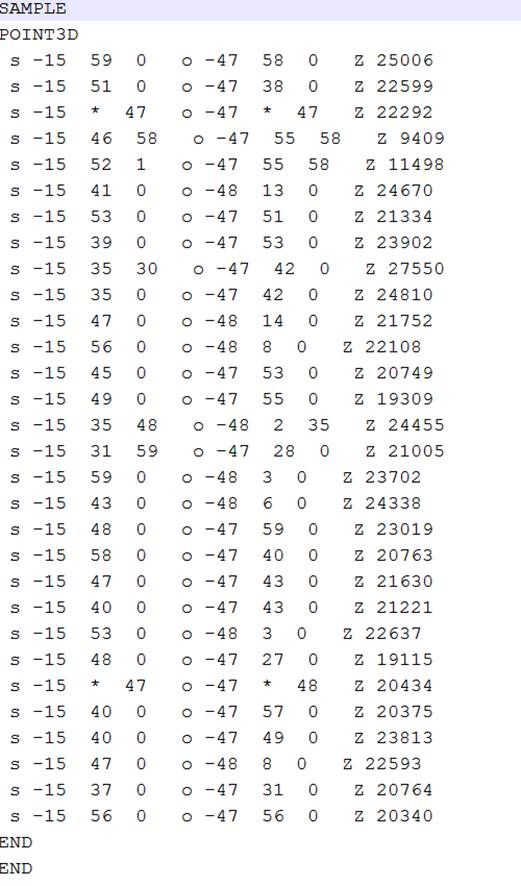<![endif]>

<a name="_Toc449440325">Figura </a><!--[if supportFields]> SEQ
Figura \* ARABIC <![endif]-->19<!--[if supportFields]><![endif]--> - Exemplo de dados exportados em formato
SPRING

<o:p>&nbsp;</o:p>

<h2><a name="_Toc457891335">1.8  IMPRIMIR SUMÁRIO</a></h2>

<o:p>&nbsp;</o:p>

            Esta função permite o envio das
informações do sumário para a impressora configurada em seu sistema.<o:p></o:p>

            Os dados das estações são impressos
na ordem especificada no campo de ordenação.<o:p></o:p>

<o:p>&nbsp;</o:p>

<!--[if gte vml 1]><v:shape
 id="_x0000_i1043" type="#_x0000_t75" style='width:138.8pt;height:87pt'>
 <v:imagedata src="readme_arquivos/image037.png" o:title=""/>
</v:shape><![endif]--><![if !vml]>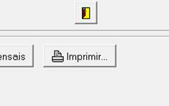<![endif]>

<a name="_Toc449440326">Figura </a><!--[if supportFields]> SEQ
Figura \* ARABIC <![endif]-->20<!--[if supportFields]><![endif]--> - Botão para imprimir o sumário das
estações<o:p></o:p>

<o:p>&nbsp;</o:p>

</body>

</html>
